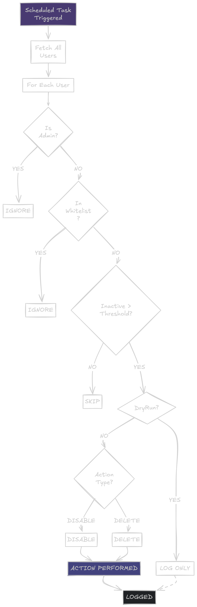

# Jellyfin-Plugin-KickUser

Jellyfin plugin to automatically disable or delete users who have been inactive for a specified period.


## Installation

1. You have to open the dashboard of your Jellyfin server. Go to Catalog, click on ⚙️ button.
2. Click to + to add the URL.

```
https://raw.githubusercontent.com/cedev-1/Jellyfin-Plugin-KickUser/master/manifest.json
```

3. On the Catalog page click on Install.

## Explanation



## License

MIT [License](./LICENSE)